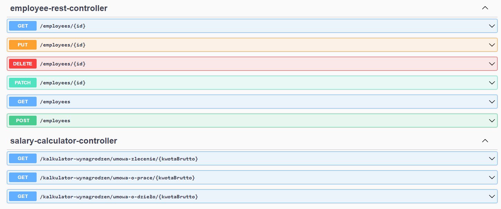
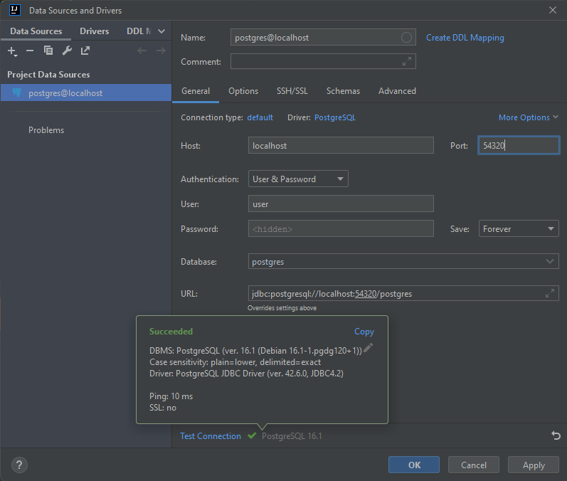

<h1 align="center">Employee Management and Salary Calculation API 
</h1>

This project is a REST API designed to manage an employee database and provide functionalities to calculate contributions along with net salary for different forms of employment. 
The API supports basic CRUD (Create, Read, Update, Delete) operations for employee data and includes specific endpoints for calculating contributions and net salary based on 3 diffrent employment contracts.
## Swagger Endpoints


## employee-rest-controller

|       ENDPOINT        | METHOD  |         REQUEST          |       RESPONSE        |                    FUNCTION                     |
|:---------------------:|:-------:|:------------------------:|:---------------------:|:-----------------------------------------------:|
|       /employees      |  GET    |             -            |   JSON (employees)    |          returns list of all employees          |
|     /employees{id}    |  GET    |    PATH VARIABLE (id)    |    JSON (employee)    |                returns employee buyId           |
|     /employees{id}    |  DELETE |    PATH VARIABLE (id)    | JSON (message, status)|                deletes employee byId            |
|     /employees{id}    |  PUT    | JSON BODY (id, employee) |    JSON (employee)    |          updates whole employee byId            |
|       /employees      |  POST   | JSON BODY (employee)     |    JSON (employee)    |                 creates new employee            |
|     /employees{id}    |  PATCH  | JSON BODY (id, employee) |      JSON (id)        |       updates choosen fields employee byId      |

## sallary-calculator-controller

|       ENDPOINT                                      | METHOD  |         REQUEST                    |       RESPONSE     |                    FUNCTION                     |
|:---------------------------------------------------:|:-------:|:----------------------------------:|:------------------:|:-----------------------------------------------:|
|/kalkulator-wynagrodzen/umowa-zlecenie/{kwotaBrutto} |  GET    |    PATH VARIABLE (kwotaBrutto)     |    JSON (salary)   | returns salary calculations for umowaZlecenie   |
|/kalkulator-wynagrodzen/umowa-o-prace/{kwotaBrutto}  |  GET    |    PATH VARIABLE (kwotaBrutto)     |    JSON (salary)   | returns salary calculations for umowaOPrace     |
|/kalkulator-wynagrodzen/umowa-o-dzieło/{kwotaBrutto} |  GET    |    PATH VARIABLE (kwotaBrutto)     |    JSON (salary)   | returns salary calculations for umowaODzieło    |

## Tech Stack
Code: <br>


<br>
Other: <br>


## How to build the project on your own
#### To build the project:
<ol>
<li>Clone the repository:</li>

```
https://github.com/WojciechWasylewski/SalaryCalculatorApi.git
```
<li>Go to the folder with cloned repository</li> 
<li>Run the command:</li>

```
docker-compose up
```
<li>You can add some example employees to database using file: src/main/resources/data.sql</li>
<ul>
  first connect your ide to database <li/>
  then use schema.sql to create table employee
</ul>
<li>RunSpringBootApplication</li>
<li>then run sql command in data.sql to add data to table employee</li>
<li>Now you can open your browser and paste this link:</li>

```
http://localhost:8080/swagger-ui/index.html#/
```
</ol>

